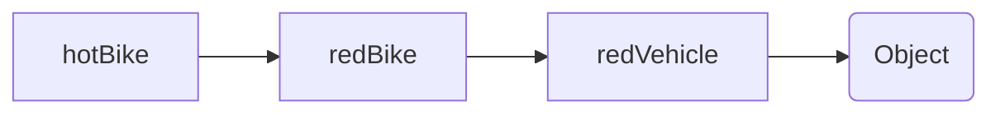
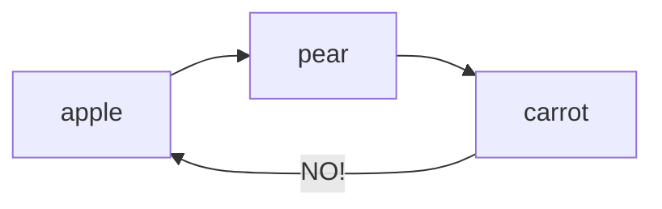

## Editor Potpourri
Editors allow us to edit the source code of our programs. The most basic example of this is your Notepad editor. When it comes to editors, you have two main options: a GUI editor or a CLI editor.

#### GUI Editors
For GUI editors, you have three main options: Atom, Visual Studio, and Sublime. There are many more, of course, but these three are the main ones that have the most support and the largest number of plug-ins.

**Atom**
<div style="text-align:center"></div>

- Made by GitHub
- Free
- Packages
- Works great with GitHub

**Visual Studio**
<div style="text-align:center"></div>

- Free
- Packages
- Much Faster

**Sublime**
- Fast
- NOT FREE --- Has free trial, but $79 for full features


#### CLI editors
For CLI editors you once again have three main options: Vim, Nano, and Emacs.
<div style="text-align:center"></div>

MacOS comes with Vim, and to get started with a basic tutorial, in your terminal type `vimtutor`. Ubuntu also has Vim has it installed. For windows, just headover [here](https://www.vim.org/download.php).

Nano comes pre-installed with Arch Linux and is similar. Emacs is preferred by most professionals.

<div style="text-align:center"></div>

## Bootstrap---Last non-AI
Bootstrap is a *front end framework*. As you may have realized, building a website from pure HTML is pretty stupid; nobody ever does it.
###### *This demo was inspired by the Bootstrap documentation*
#### Setting up---your first project
Here's your starting code---check the comments and ask what you don't know:
```html
<!doctype html>
<html lang="en">
    <head>
        <!-- Meta tags - notice bootstrap is "mobile first" -->
        <meta charset="utf-8">
        <meta name="viewport" content="width=device-width, initial-scale=1, shrink-to-fit=no">

        <!-- Grabbing dat bootstrap CSS -->
        <link rel="stylesheet" href="https://stackpath.bootstrapcdn.com/bootstrap/4.1.3/css/bootstrap.min.css" integrity="sha384-MCw98/SFnGE8fJT3GXwEOngsV7Zt27NXFoaoApmYm81iuXoPkFOJwJ8ERdknLPMO" crossorigin="anonymous">

        <title>Title (check me out in the browser tab)</title>
    </head>
    <body>
        <h1>Body text!</h1>


        <!-- We must import jQuery, ajax, and some javascript libraries. Don't worry about this yet, but it will be important later -->
        <script src="https://code.jquery.com/jquery-3.3.1.slim.min.js" integrity="sha384-q8i/X+965DzO0rT7abK41JStQIAqVgRVzpbzo5smXKp4YfRvH+8abtTE1Pi6jizo" crossorigin="anonymous"></script>
        <script src="https://cdnjs.cloudflare.com/ajax/libs/popper.js/1.14.3/umd/popper.min.js" integrity="sha384-ZMP7rVo3mIykV+2+9J3UJ46jBk0WLaUAdn689aCwoqbBJiSnjAK/l8WvCWPIPm49" crossorigin="anonymous"></script>
        <script src="https://stackpath.bootstrapcdn.com/bootstrap/4.1.3/js/bootstrap.min.js" integrity="sha384-ChfqqxuZUCnJSK3+MXmPNIyE6ZbWh2IMqE241rYiqJxyMiZ6OW/JmZQ5stwEULTy" crossorigin="anonymous"></script>
  </body>
</html>
```


#### Containers
These are the main layout elements in Bootstrap. There are two types of containers:
- Regular

```html
<div class="container" id="uniqueId1">some text</div>
```

- Fluid - fills content space

```html
<div class="container-fluid" id="uniqueId1">some text</div>
```

#### Grids
Bootstrap's responsive grid system allows for variable columns. There are four main classes:

* **xs** (for phones - screens less than 768px wide)
* **sm** (for tablets - screens equal to or greater than 768px wide)
* **md** (for small laptops - screens equal to or greater than 992px wide)
* **lg** (for laptops and desktops - screens equal to or greater than 1200px wide)

The classes above can be combined to create more dynamic and flexible layouts. Within a *row* class, you must have several *cols* with different widths; the notation is `<div class="col-*-*">`

These column widths should normally add up to 12. Check out the demo and mess around with it---it's your playground.


#### Demo---have fun with this
```html
<!DOCTYPE html>
<html lang="en">
<head>
    <title>Bootstrap Example</title>
    <meta charset="utf-8">
    <meta name="viewport" content="width=device-width, initial-scale=1">
    <link rel="stylesheet" href="https://maxcdn.bootstrapcdn.com/bootstrap/3.3.7/css/bootstrap.min.css">
    <script src="https://ajax.googleapis.com/ajax/libs/jquery/3.3.1/jquery.min.js"></script>
    <script src="https://maxcdn.bootstrapcdn.com/bootstrap/3.3.7/js/bootstrap.min.js"></script>
    <style>
    #bordered {
        border-style:solid;
            padding: 1px;
            border-widt:light;
    }
    </style>
</head>
<body>

<div class="container-fluid">
    <h1>Hello World!</h1>
    <p>Resize the browser window to see the effect.</p>
    <p>The columns will automatically stack on top of each other when the screen is less than 768px wide.</p>
    <p>Notice what happens when columns don't add up to 12 (second row)</p>
    <div class="row">
        <div class="col-sm-4" style="background-color:lavender;" id="bordered">.col-sm-4</div>
        <div class="col-sm-8" style="background-color:lavenderblush;" id="bordered">.col-sm-8</div>
    </div>
    <div class="row">
        <div class="col-lg-7" style="background-color:lavender;" id="bordered">.col-lg-7</div>
        <div class="col-lg-4" style="background-color:lavenderblush;" id="bordered">.col-lg-3</div>
    </div>
</div>

</body>
</html>
```
#### Text in Bootstrap
Bootstrap comes with many simple tags for text manipulation. Add these to your demo and experiment.
```html
<p>Use the mark element to <mark>highlight</mark> text.</p>
<p>Abbr will do this: <abbr title="United States">US</abbr>. Below is a blockquote.</p>
<blockquote class="blockquote-reverse">
<p>This is a quote. Remove the "blockquote-reverse" class and see what happens.</p>
<footer>This is a footer.</footer>
</blockquote>
<p>The dl element indicates a description list:</p>
<dl>
<dt>Gautom</dt>
<dd>- Short indian guy</dd>
<dt>Zach</dt>
<dd>- Kinda just smiles</dd>
<dt>Prayag</dt>
<dd>- Follow him on Twitter @PrayagGordy</dd></dl>  
<p>Here's some code: <code lang="python">print("hello world")</code></p>
<p>Kbd is for keyboard <kbd>alt + F4</kbd></p>
```
#### Other stuff
The above methods are some basic commands in Bootstrap. It wouldn't make sense to explain the hundreds of functionalities within it, so instead, use the [documentation](http://getbootstrap.com/docs/4.1/getting-started/introduction/) and [references](https://www.w3schools.com/booTsTrap/default.asp) to complete projects as you wish. Below, in the "challenges" section, we have some problems to get you more familiar with this framework. Try them all. Note that the most important part isn't exactly the CSS, but rather knowing what to do and how to get close to this main goal.

Other useful resources:
* StackOverflow
* Google

#### Challenges
* Make [this](https://tinyurl.com/devdemo1) website *(uses JavaScript)*
* Make a project describing yourself incorporating:
    * Jumbo trons
    * Dynamic Inputs
    * Pagination (About, Contact, etc.)
    * Carousel
    * Some sort of JavaScript animation
    * *\*hard\** Use jQuery to create a tooltip or popover *\*hard\**
    * *\*very hard\** Using a working scrollspy *\*very hard\**

    * Throw this online and reference it to employers so you look really professional---this can be a personal website

* Try breaking Bootstrap (Prize = ***infinite*** clout)

## JavaScript
###### *Before beginning, you should be familiar with our [introduction to JS](https://devclub.ml/2018/09/26/web-development.html#javascript). Here's a good [cheat sheet](https://javascript.info/javascript-specials) for the fundamentals.*

### Functions
We'll first review functions. Functions allow the programmer to use the same script multiple times in a program *without* copy-pasting the code, which is one of the worst things you can do.

> Imagine this: you write code for a task that needs to be repeated multiple times. You then change the main datatype for the function's input. Instead of just changing it once, you have to go through and fix it again and again; it's even annoying to copy-paste again because you changed the variable names. **Use functions.**

A simple JS function looks like the following:
```javascript
function showMessage() {
    alert( 'Hello everyone!' );
}
```
Following with the above example, if the message changes every time, copy-pasting would be a *terrible* idea. By creating a function, we can also ask for a **parameter**:
```javascript
function showMessage(text, name) {
    var newText = "My message is: " + text + " from " + name;
    alert(newText);
}

showMessage("Stay smiling", "Dev Club")
```
The above example also contains a **local variable**, which is a variable whose **scope** is only within the function. In other words, the variable `newText` from `showMessage()` has no effect on any other part of the code. In JS, variables defined in the `<script>` tag but not in a specific function are **global**, so one can still reference them in every function.

If you have a function with a parameter that only sometimes needs changing, you can use **default values**. For an example, think of a function that figures out how to give a customer change in the least number of coins possible:
```javascript
function giveChange(smallest = 0.01, secondSmallest = 0.05, secondLargest = 0.1, largest = 0.25, amount) {
    //implementation
}

giveChange(10.03);
giveChange(largest = 0.5, 10.03);
```
As in other programming languages, JavaScript functions can **return** values using `return` at the end of the function.

Our suggestion for coding is to first **make a plan**. Do only one thing in a function; it's always easier to debug and to read.

### Objects

In JavaScript, objects have **properties** and **methods**. For example, a dog "object" may have properties like "brown" and "female," as well as methods like "bark" and "run."

#### Properties

Objects behave like variables, except that they can contain several values. When declaring an object, properties are written in a set of **name: value** pairs. For example, we can define an object to represent our dog:

```javascript
var dog = {color: "brown", gender: "female", age: 9, name: "Princess", breed: "Pomeranian"};
```
In the above example, the value "brown" is given to the "color" property, "female" to the "gender" property, and so on.

Objects can also be created using the ``new`` keyword.
```javascript
var dog = new Object();
dog.color = "brown";
dog.gender = "female";
//...
```

These properties can be accessed in two ways: ``object.property`` or ``object["property"]``. Continuing the example, we could access the properties of our dog by writing:
```javascript
dog.color; // brown
dog["gender"]; // female
```

A consequence of this is that JavaScript objects are **mutable**, meaning they aren't addressed by value, but rather by reference. In other words, in the snippet `javascript var x = dog;`, the object `x` is not a copy of dog, it *is* dog. Changes to `x` will also be changes to dog; they're the same object.

#### Arrays
Arrays are collections of a single type of object. They can be nested and have multiple dimensions.

```javascript
var dogs = ["Big One", "Little One", "Purple One"];
```

Accessing a specific variable or object in the array is as simple as `dogs[2]`.

Remember: *All arrays in JavaScript start at 0.*

Here is a table of array methods, courtesy of [w3schools](https://www.w3schools.com/jsref/jsref_obj_array.asp).

| Method | Description |
| -------- | -------- |
concat()	|Joins two or more arrays, and returns a copy of the joined arrays
copyWithin()	|Copies array elements within the array, to and from specified positions
entries()	|Returns a key/value pair Array Iteration Object
every()	|Checks if every element in an array pass a test
fill()	|Fill the elements in an array with a static value
filter()	|Creates a new array with every element in an array that pass a test
find()	|Returns the value of the first element in an array that pass a test
findIndex()	|Returns the index of the first element in an array that pass a test
forEach()	|Calls a function for each array element
from()	|Creates an array from an object
includes()	|Check if an array contains the specified element
indexOf()	|Search the array for an element and returns its position
isArray()	|Checks whether an object is an array
join()	|Joins all elements of an array into a string
keys()	|Returns a Array Iteration Object, containing the keys of the original array
lastIndexOf()	|Search the array for an element, starting at the end, and returns its position
map()	|Creates a new array with the result of calling a function for each array element
pop()	|Removes the last element of an array, and returns that element
push()	|Adds new elements to the end of an array, and returns the new length
reduce()	|Reduce the values of an array to a single value (going left-to-right)
reduceRight()	|Reduce the values of an array to a single value (going right-to-left)
reverse()	|Reverses the order of the elements in an array
shift()	|Removes the first element of an array, and returns that element
slice()	|Selects a part of an array, and returns the new array
some()	|Checks if any of the elements in an array pass a test
sort()	|Sorts the elements of an array
splice()	|Adds/Removes elements from an array
toString()	|Converts an array to a string, and returns the result
unshift()	|Adds new elements to the beginning of an array, and returns the new length
valueOf()	|Returns the primitive value of an array


#### Methods

Methods are functions that are stored as properties of objects. They represent actions performed on objects. If we wanted a `description` method for our dog, we could declare it as follows:

```javascript
var dog = {
    color: "brown",
    gender: "female",
    age: 9,
    name: "Princess"
    breed: "Pomeranian"
    description: function(){
        return this.name + " is a " + this.color + " " + this.breed ".";
    }
};
```

>The `this` in the function is similar to the usage of `this` in Java. It refers to the object performing the method: the dog.

You can call methods just like you can access a property. To call the`description` method:
```
dog.description(); // Princess is a brown Pomerarian.
```

One type of common method is a **constructor**. Constructors establish a template for creating new objects. Here's an example of a ``dog`` constructor:
```javascript
function Dog(c, n, b) {
    this.color = c;
    this.name = n;
    this.barkMessage = b;
    this.bark = function{
        console.log(barkMessage);
    }
}
var d = new Dog("gray", "Spike", "Bork bork");
```

### Prototypes

One of the principles of Object Oriented Programming (OOP) is inheritance. As your code becomes complicated, inheritance can help reduce reused code, just like functions.

In JS, inheritance is managed through a concept called **prototype**.

Every JS object has this special property called `[[prototype]]`. To get this property, we could use `object.__proto__;`

**Prototype object**: The template that object inherits from, think of as the "super."

**Prototype chain**: Linking multiple prototypes, one after another, would create this chain. Resembles a linked list.

<div style="text-align:center"></div>

Inheritance allows the child to inherit properties from its prototype (parent) object. So, when a method or property is not found within the object itself, JS would look for that missing information in the prototype.

As an example, let's create two objects, with miniVehicle (parent) as the prototype object of bike (child).
```javascript
let redVehicle = {
    color: "red";
};
let redBike = {
    numWheels: 2;
};

redBike.__proto__ = redVehicle;
```
Testing out the code:
```
console.log(redBike.numWheels); // Prints 2
console.log(redBike.color); // Prints "red"
```

In this scenario, JS looks through bike's properties, but does not find the property "color." So, it goes through its prototype object, redVehicle, to find it.

Now, linking multiple classes together would create a prototype chain.

```javascript
let redVehicle = {
    color: "red";
    honk() {
        alert("BOOO!");
    }
};
let redBike = {
    numWheels: 2;
    dash() {
        alert("VROOOOOOOM!")
    }
};
let hotBike = {
    model = 9001;
}


redBike.__proto__ = redVehicle;
hotBike.__proto__ = redBike;

hotBike.dash(); // This is redBike's method
hotBike.honk(); // This is redVehicle's method
```

When invoking `hotBike.honk()`, JS looks at hotBike's prototype, which is redBike. It does not find it, so it examines redVehicle.

This a diagram of the prototype chain:


#### Prototype Chains
Although prototype chains are incredibly powerful, there are some limitations. Firstly, you cannot make cycles (no shit!). In other words, something like this is not allowed:

```
let apple = {};
let pear = {};
let carrot = {};

apple.__proto__ = pear;
pear.__proto__ = carrot;
apple.__proto__ = apple; // ERROR!!!
```



Secondly, if you try to set a object's prototype to a primitive, it will be ignored.


#### Getters and Setters

Getters and setters in JS are a bit quirky. They're denoted by the `get` and `set` keywords, respectively.

Here is an example of getters and setters:

```javascript
let car = {
    brand: "Generic",
	model: "1000",
	set name(value) {
		[this.brand, this.model] = value.split(" ");
	},
	get name(value) {
		return `${this.brand} ${this.model}`; // This JS string formatting.
	},
	drive() {
		alert(`The ${this.model} Vrooms!`);
	}
};

car.model = "Toyota Camry";
car.drive();
console.log("What is " + car.name + "?")
```


### Classes

Introduced in EMCAScript 2015, classes are really just an abstraction of the prototype model of JS. Under the hood, they're just modified constructor methods.

```javascript
class User {

  constructor(name) {
    this.name = name;
  }

  sayHi() {
    alert(this.name);
  }

}

let user = new User("John");
user.sayHi();
```
